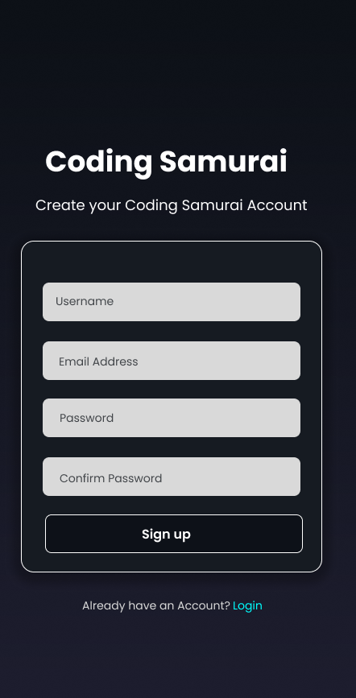
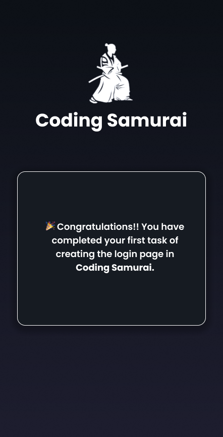

# 🎨 Task 1 - UI Design (Coding Samurai Internship)

### 🎯 Objective
Redesign and enhance the login flow of an application to improve usability and aesthetics.

---

### 🧠 What I Did
- Designed multiple UI screens in **Figma**:
  - Intro Screen (Splash Screen)
  - Login Page
  - Signup Page
  - Forgot Password Page
  - Hover States
  - Output Page
- Used **Smart Animate** and **delays** for smooth, interactive transitions.
- Focused on modern layout, color balance, and typography.

---

### 🛠 Tools Used
- Figma

---

### 🔗 Figma Design Link
[👉 Click here to view my Figma design](https://www.figma.com/design/A9IL3SkdCXRHV7F6w1fNNn/Coding-Samurai?node-id=0-1&t=IG8u6NcHudh10FkX-1)

---

### 🎥 Demonstration Video
[🎬 Watch my LinkedIn Post](https://www.linkedin.com/feed/update/urn:li:activity:7390771290128859137/)

---

### 📸 Screenshots

#### 1. Intro Screen (Splash Screen)

#### 2. Login Page

#### 3. Login Page Hover

#### 4. Signup Page

#### 5. Signup Page Hover

#### 6. Forgot Password Page

#### 7. Output Page

---

### 🔖 Hashtags Used
#CodingSamurai #Internship #UIDesign #AppDevelopment
